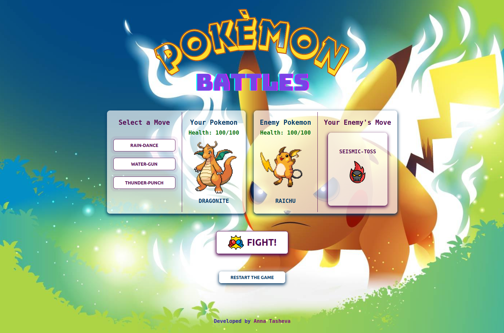

# Pokemon Battles Game

Welcome to the Pokemon Battles Game!
In this browser-based game, you will engage in epic duels between various Pokemon. Select your Pokemon, choose their attack, and engage in battles against randomly chosen enemy Pokemon. It's a simple and fun way to immerse yourself in the Pokemon universe. Built using only JavaScript, CSS, and HTML.



## Features

-   **Pokemon Selection**: You can load various Pokemon from the PokeAPI and choose one from three options to be your partner in battles.
-   **Attack Choices**: You get to choose the attack for your Pokemon, and with each turn, you can select a different attack strategy.
-   **Random Enemy**: The enemy Pokemon is selected randomly, making each battle unique and exciting.

For more information about the PokeAPI used in this project, please visit the [PokeAPI documentation](https://pokeapi.co/docs/v2).

## Tech Stack

The Pokemon Battles Game is built with the following technologies:

-   **JavaScript**: The core logic of the game is implemented using JavaScript to manage game mechanics and interactions.
-   **CSS**: CSS styles are applied to make the game visually appealing and user-friendly.
-   **HTML**: The game's structure and layout are created using HTML.

## Getting Started

To get started with the Pokemon Battles Game, follow these steps:

1. Clone this repository to your local machine:

    ```bash
    git clone https://github.com/AnnaTas77/pokemon-battles
    ```

2. Navigate to the project directory:

    ```bash
    cd pokemon-battles
    ```

3. Open `index.html` in your preferred web browser.

## Connect

I am enthusiastic about connecting with fellow web development enthusiasts and potential collaborators. Your support and constructive feedback are invaluable. 🚀
